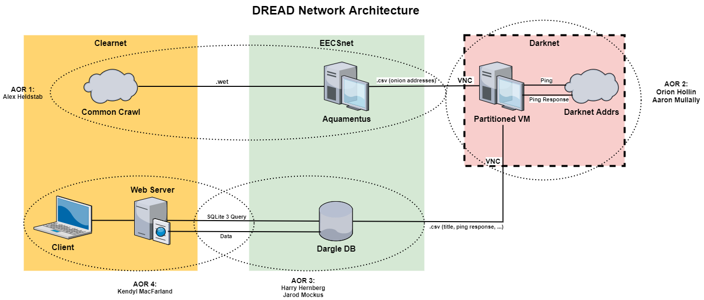

# DREAD

## Network Diagram

## Project Overview

Our project focuses on cryptocurrency and the dark web, along with tracking illegal activity that may occur over such dark web servers. The inspiration for this project came from a guest lecture from the New York Police Department (NYPD) last year. The NYPD visit prompted two former Cadets to start the project looking to find a better means of tracking illegal dark web activity. After a virtual meeting with the NYPD, our group decided to take a new approach in contrast with the former group. Switching from the old project, Dargle, to our project, Dread, we want to build a self-updating search engine that parses and categorizes plaintext from dark websites that we crawled on the clear web. Thus, our motivation for the project is to improve the NYPD’s investigative abilities on the dark web so that they have an easier way of identifying possible illegal activity.

##Project Goal

Our goal is to be able to identify, collect, and compile the dark web addresses from the surface web into a searchable website. We want the NYPD to be able to search our database using different keywords to find a possibly criminal website on the dark web. This project essentially provides clues and tips to the NYPD for their follow on investigation.

## Members of the Team

* Alex Heldstab 
* Harry Hernberg
* Orion Hollin
* Kendyl McFarland
* Jarod Mockus
* Aaron Mullally

## Instructor

* Mr. Michael Kapralos

## Advisor

* MAJ Nathaniel Stickney

## Product Owners

* New York Police Department
